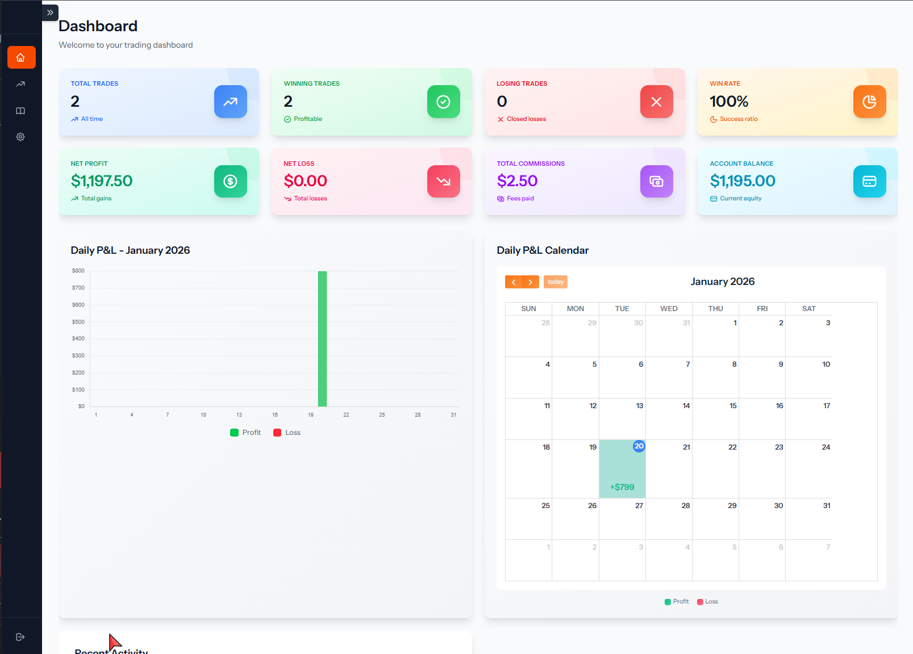

# Tradelog

A trading journal and analytics platform for tracking, analyzing, and improving your trading performance.


---

## Screenshots




---

## Features

- 📊 **Trade Management** — Track stocks, options, and futures positions
- 📈 **FIFO Position Tracking** — Automatic first-in-first-out position calculation
- 📅 **Trading Diary** — Document your trading decisions and lessons learned
- 🔄 **Auto Import** — Import trades directly from Interactive Brokers using Flex API
- 📉 **Performance Analytics** — Dashboard with P&L charts and statistics
- 🏷️ **Trade Tags** — Organise trades by setup type and strategy
- 🔍 **Advanced Filtering** — Filter trades by symbol, date, P&L, tags, and more
- 📱 **Responsive Design** — Works on desktop and mobile

---

## Running with Docker

This is the easiest way to run Tradelog — no PHP, Node, or Composer needed on your machine.

### Prerequisites

- [Docker Desktop](https://www.docker.com/products/docker-desktop/) installed and running

### Windows (double-click launch)

1. Clone or download this repository
2. Double-click **`setup.bat`** — this generates the icon and creates the shortcut (only needed once after cloning)
3. Double-click **`Tradelog.lnk`** to launch the app

That's it. The app will start Docker, wait until it's ready, and open your browser automatically. An Exit button window will appear — click **Exit** to stop the app cleanly.

To launch again in future, just double-click **`Tradelog.lnk`**.

### Manual (any OS)

1. **Clone the repository:**
   ```bash
   git clone https://github.com/habeebb21/Tradelog.git
   cd Tradelog
   ```

2. **Build and start:**
   ```bash
   docker compose up -d --build
   ```

3. **Open the app:**
   ```
   http://localhost:8080
   ```

4. **To stop:**
   ```bash
   docker compose down
   ```

> Your data is stored in the `database/` folder and persists across restarts.

---

## Tech Stack

- **Backend:** Laravel 11.x
- **Frontend:** Blade Templates, TailwindCSS
- **Database:** SQLite
- **Charts:** Chart.js, FullCalendar
- **Build Tool:** Vite

---

## Importing Trades

### From CSV

1. Export your trade history from your broker
2. Go to **Add Trade → Import CSV**
3. Select Interactive Brokers format and upload

### Auto Import (Interactive Brokers)

1. Log in to Interactive Brokers
2. Go to **Account Management → Reports → Flex Queries**
3. Create a new Flex Query:
   - Sections: **Trades** (select all fields)
   - Format: **CSV**, include column headers, no section codes
   - Date Format: `yyyy-MM-DD`, Time Format: `HH:mm:ss`
   - Date/Time Separator: single space
4. Note your **Query ID**
5. Generate a **Flex Token** from IB security settings
6. In Tradelog go to **Add Trade → Auto Import** and enter your token and query ID
7. Click **Import Trades**

---

## Acknowledgments

- Built with [Laravel](https://laravel.com)
- UI by [TailwindCSS](https://tailwindcss.com)
- Charts by [Chart.js](https://www.chartjs.org)
- Calendar by [FullCalendar](https://fullcalendar.io)
